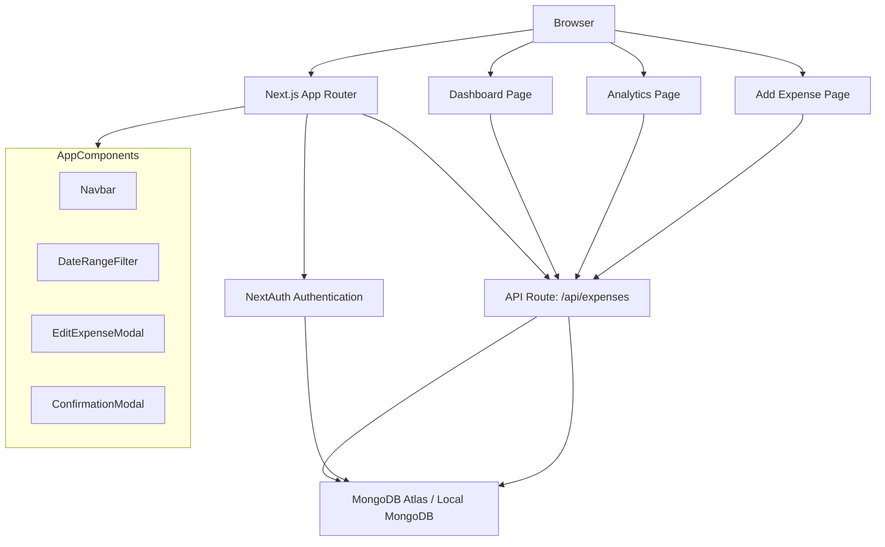

# Expense Tracker Architecture

This expense tracker is built with Next.js App Router, MongoDB, and NextAuth. It uses a serverless API backend with client-side analytics and dashboard pages.

## Architecture Overview

## Key Components

- `app/components/Navbar.tsx` — Global navigation and authenticated user menu.
- `app/components/DateRangeFilter.tsx` — Shared date range selector for dashboard and analytics.
- `app/components/EditExpenseModal.tsx` — Expense editing modal.
- `app/api/expenses/route.ts` — CRUD API for expense records.
- `app/dashboard/dashboardclient.tsx` — Main dashboard with filters, stats, and expense list.
- `app/analytics/page.tsx` — Interactive analytics dashboards with charts.

## Data Flow

1. User authenticates via NextAuth.
2. Pages call `/api/expenses` to create, read, update, and delete expense data.
3. Analytics page fetches expense records and aggregates totals by date, category, and mode.
4. Dashboard page filters expenses by date range and shows recent spending summaries.

## Deployment

- Host the Next.js app on Vercel or any Node.js-compatible host.
- Configure environment variables for MongoDB and NextAuth.
- Use MongoDB Atlas or local MongoDB for persistence.

## Environment Variables

- `MONGODB_URI`
- `NEXTAUTH_SECRET`
- `NEXTAUTH_URL`
- Any provider-specific variables required by NextAuth.
